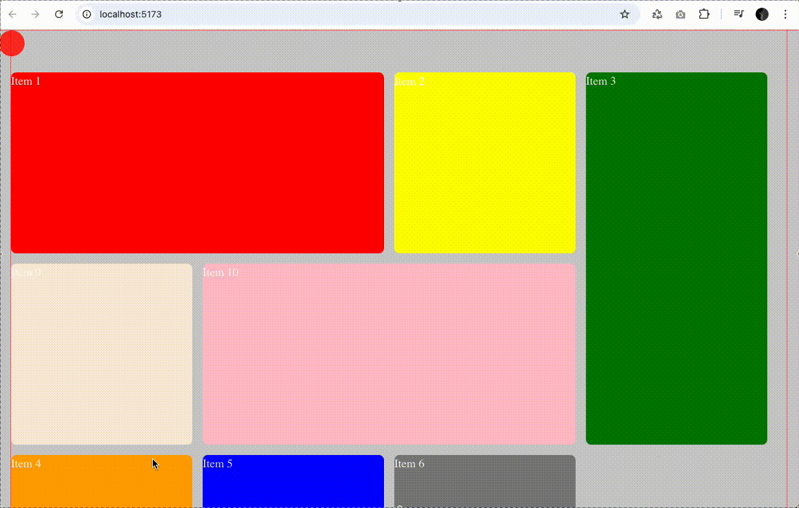

# Vue3 - Auto grid Sample

Grid layout with Vue3 and CSS Grid. 
This is a simple example of how to create a responsive grid layout using Vue3 and CSS Grid.

When moving you can see where the item passes through the grid.

Reference web site: https://nevflynn.com/?ref=sychev

## DEV

Install: `$ npm i`

Run: `$ npm run dev` or `$ npm run serve` 
